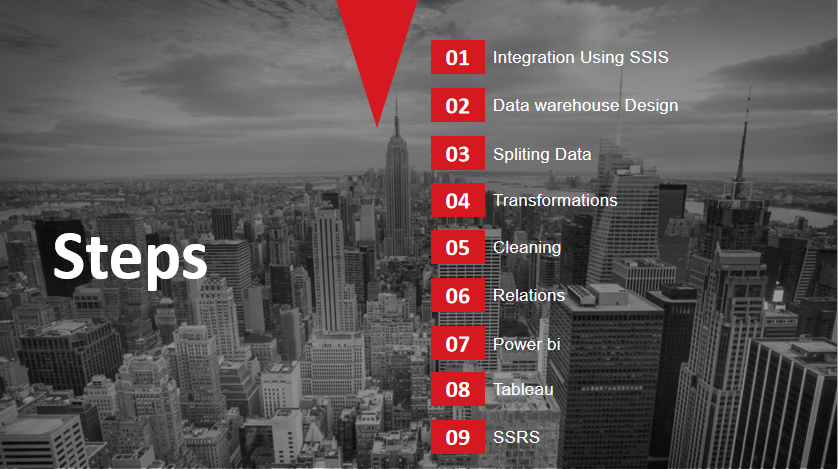
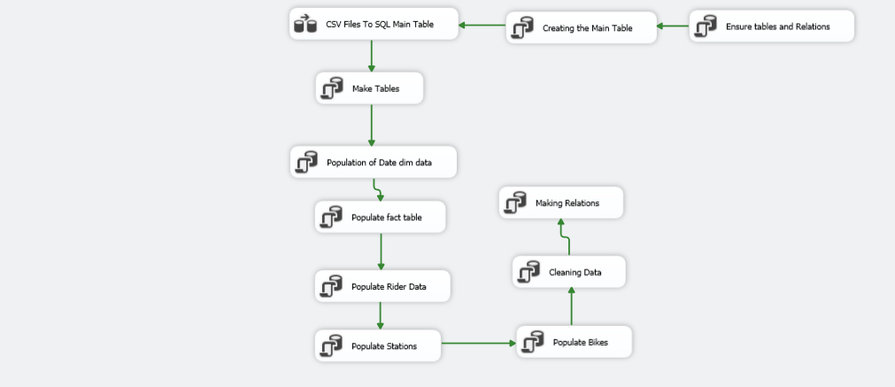
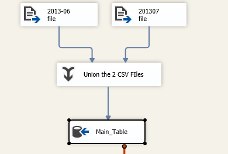
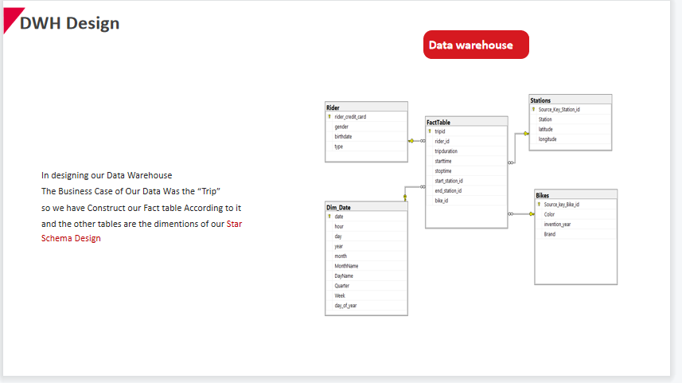
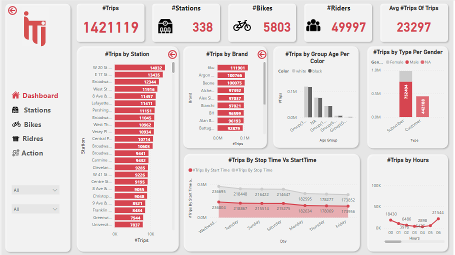
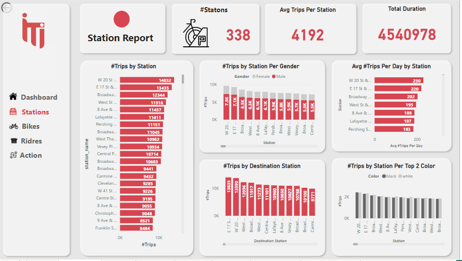
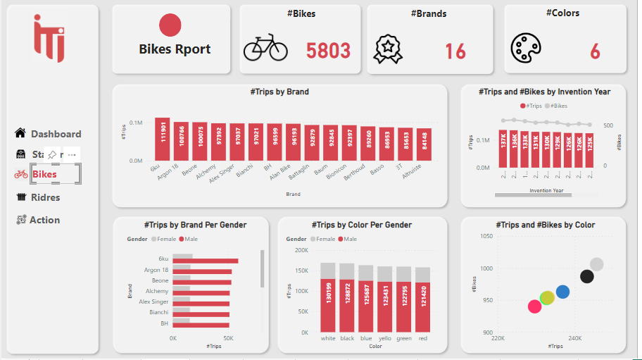
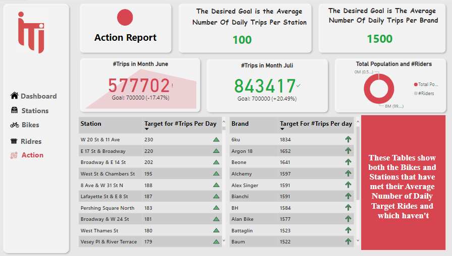

# City_Bike_Project
### The Steps Of Project : 
###           
###         

### => ETL Step 
#### Using SSIS Tool For Collectiong Data From CSV Files , Making Data Transformation & Clealing & Creating Constraints And RelationShip Between Fact And Dimensions For Reach To Data Warehouse Design as star schema

### => Data Warehouse Design

### => Making Analysis By ( SQL [ Views , SP ] And DAX )
### => Making Visualization Using Power BI Tool
#### -- Main Dashboard

#### -- Station Report

#### -- Bikes Report

#### -- Rider Report

#### -- Action Report

 
